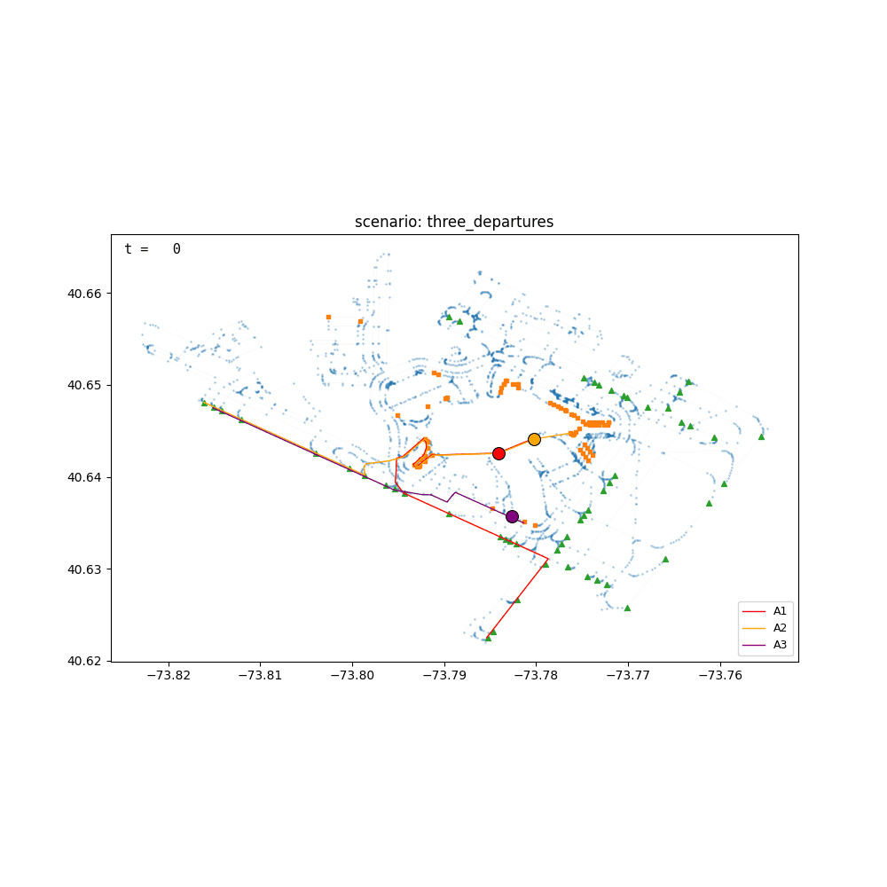
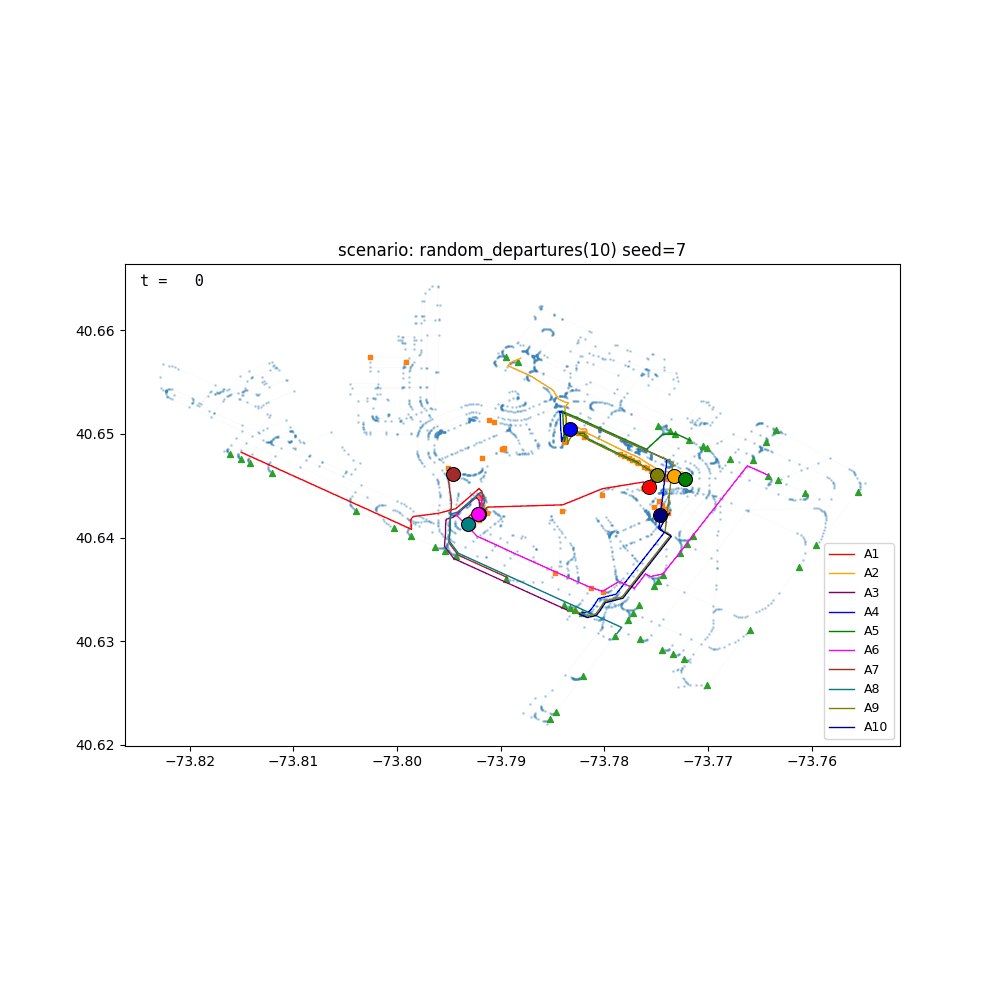

# Airport Surface Movement Simulator

A discrete-time simulation of airport surface movement using a graph-based taxiway model.

Aircraft taxi along a predefined airport graph from start nodes (stands) to goal nodes (runway or aprons), subject to safety and fairness constraints. The project explores whether simple local rules can produce safe, deadlock-free surface movement without global scheduling.

This is a simulation and research exploration only. It is **not** intended for real-world deployment.



*Three departures from JFK stands to runway holds. Faint lines show planned routes; solid markers show live aircraft positions. A2 visibly waits two ticks behind A1 at a shared intersection before the priority resolver releases it.*

---



*10 aircraft for departure, completed in 43 steps, zero deadlocks, but 5 of the 10 got priority-blocked at intersections at some point (A3 waited a maximum of 3 ticks, A6 and A8 each waited 2).*

---

## Motivation

Modern aircraft can autoland reliably, but ground movement (taxiing) remains operationally complex and heavily dependent on human controllers and procedural separation.

This project investigates whether airport surface movement can be:
- modelled as a graph problem
- coordinated using local rules rather than global planning
- kept safe (collision-free) while guaranteeing progress and fairness

The focus is on reasoning, correctness, and failure modes rather than optimisation or real-time performance.

---

## Model Overview

- The airport surface is represented as an **undirected graph**
- Nodes represent:
  - stands
  - taxiway intersections
  - runway access points
  - the runway
- Edges represent taxiways


Each aircraft:
- computes a path to its goal using BFS
- proposes a next node each simulation tick
- optionally proposes a lookahead *corridor* of future nodes
- may be blocked due to:
  - exclusive node occupancy
  - corridor constraints (deadlock prevention)
  - priority rules (fairness)

The simulation advances in discrete time steps (“ticks”).

---

## Safety and Coordination Rules

Implemented rules include:

- **Exclusive nodes**  
  Certain nodes (intersections, runway access points, runway) may only be occupied by one aircraft at a time.

- **Corridor lookahead**  
  Aircraft may only enter a shared choke point if they can safely clear it, preventing deadlock.

- **Fair priority resolution**  
  When multiple aircraft request the same exclusive node, priority is given to the aircraft that has waited the longest, with a deterministic tie-break.

- **Deadlock detection**  
  If no aircraft makes progress for several consecutive ticks, the simulation terminates.

---

**Current Features**
- Graph-based airport surface model built from real OpenStreetMap data (JFK)
- Dijkstra path planning over a haversine-weighted graph
- Graph compression that collapses degree-2 intersections for shorter paths
- Exclusive node collision avoidance
- Corridor-based deadlock prevention
- Wait-time based priority (fairness)
- Deadlock detection and termination
- Debug output explaining blocking reasons
- Deterministic behaviour for identical scenarios
- Animated playback with sub-tick interpolation, exportable as GIF
- Command-line interface with multiple selectable scenarios

---

**Limitations**
- Taxiways are undirected and idealised
- Taxiway segments (edges) are not yet locked
- All movements take one tick (no timing or speed model)
- No sensor uncertainty or perception errors
- All aircraft spawn simultaneously at t=0 (no staggered entry)

---

**Planned Work**
- Edge locking for single-lane taxiways
- Staggered aircraft spawn times
- Larger stress-test scenarios (10+ aircraft)
- Comparison of different priority policies (local rules vs. Conflict-Based Search)
- Parameterise by IATA code so any airport can be loaded

---

## Running the Simulation

Scenarios are defined in the `SCENARIOS` dictionary in `airport_mapper/scenarios.py`. Each scenario specifies:
- aircraft ID
- start node
- goal node

### Requirements
- Python 3.10+
- `matplotlib` (for plotting and animation)
- `pillow` (for GIF export)
- `requests` (only needed if you re-run the OSM graph build)
- `pytest` (only needed for tests)

```bash
pip install matplotlib pillow requests pytest
```

### Run

List the available scenarios:
```bash
python -m airport_mapper.main_sim --list
```

Run the default scenario with a static route plot:
```bash
python -m airport_mapper.main_sim
```

Run a specific scenario:
```bash
python -m airport_mapper.main_sim --scenario stand_swap
```

Play an animation in an interactive window:
```bash
python -m airport_mapper.main_sim --scenario three_departures --animate
```

Save the animation as a GIF:
```bash
python -m airport_mapper.main_sim --scenario three_departures --save-gif demo.gif
```

Print a per-tick timeline for a single aircraft, headless:
```bash
python -m airport_mapper.main_sim --scenario stand_swap --no-plot --timeline A1
```

Full flag reference: `python -m airport_mapper.main_sim --help`

### Tests

```bash
python -m pytest tests/
```

### Multi-airport support

Airport graphs live in `airport_mapper/airports/`, one JSON per IATA code. JFK ships with the project; other airports are fetched and built on demand from OpenStreetMap via the Overpass API.

To run on a new airport:

```bash
# Fetch the OSM data and build the graph (one-time, requires network)
python -m airport_mapper.overpass_query LHR
python -m airport_mapper.polyline_to_graph --iata LHR

# Or do both in one step (build_airport_graph auto-fetches if cache is missing)
python -m airport_mapper.polyline_to_graph --iata LHR

# Then run a simulation on it
python -m airport_mapper.main_sim --iata LHR --random-departures 10 --animate
```

The `--iata` flag accepts any airport code with `aeroway=aerodrome` and an `iata` tag in OSM. Note that the named scenarios in `scenarios.py` use JFK-specific node IDs and only work for JFK; for other airports use `--random-departures`, `--random-arrivals`, or `--random-mixed`.

### Rebuilding the JFK graph

The labelled JFK graph (`airport_mapper/airports/JFK.json`) is a versioned build artifact. If the OSM data changes or the labelling logic is updated:

```bash
python -m airport_mapper.polyline_to_graph --iata JFK --no-fetch
```

Importing the package never triggers a rebuild.

### Author

George
