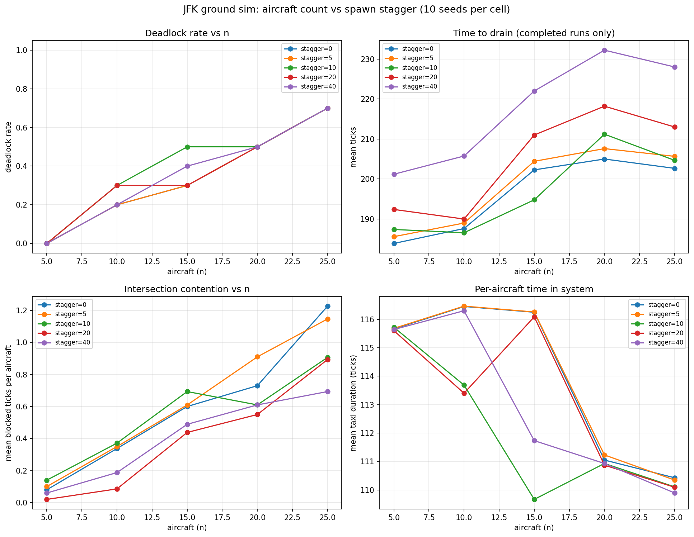

# Stress test: how many aircraft can JFK absorb, and does staggering help?

A parameter sweep over the simulator with random departure scenarios. The
goal was to characterise the local-rules conflict resolver under load and
quantify whether spreading aircraft entry over time (rather than all at
t=0) improves the outcome.

> **Update note (v2).** This report was originally produced when path
> planning emitted a *compressed* path that skipped degree-2 intersection
> nodes. The simulator therefore advanced each aircraft across an entire
> compressed edge per tick, hiding fine-grained conflicts at intermediate
> intersections. The pathing was fixed to expand the planned route back
> to raw graph nodes before simulation, and this report reflects the new
> behaviour. A v1-vs-v2 comparison is included at the end.

## Setup

- **Airport**: JFK, real OpenStreetMap-derived graph (3,563 nodes, 3,790 edges)
- **Aircraft count (n)**: 5, 10, 15, 20, 25
- **Stagger window**: 0, 5, 10, 20, 40 (uniform spawn-tick distribution in [0, stagger])
- **Seeds per cell**: 10
- **Total runs**: 250
- **Wall-clock**: 2.5 seconds (mean 10 ms per run)
- **Path planner**: Dijkstra over the haversine-weighted, intersection-compressed graph, then expanded back to raw nodes so the simulator visits every node in jfk_graph_labeled.json
- **Conflict resolver**: longest-waiting priority with two-phase (vacate, occupy) commit
- **Deadlock rule**: 3 consecutive ticks of no movement among spawned, active aircraft
- **max_steps**: 2000

Each scenario is a set of `n` random stand-to-runway departures with
validated paths. The same RNG seed produces the same scenario, so results
are perfectly reproducible.



## Findings

### 1. Deadlock onset starts earlier and rises faster than v1 suggested

With raw-graph paths the local-rules engine struggles much sooner. The
inflection point at n=20 is preserved, but the absolute rates are higher
across the board.

| n  | deadlock rate (stagger=0, v2) | (v1 for comparison) |
| -- | ----------------------------- | ------------------- |
| 5  | 0%                            | 0%                  |
| 10 | 20%                           | 10%                 |
| 15 | 30%                           | 20%                 |
| 20 | 50%                           | 50%                 |
| 25 | 70%                           | 60%                 |

The qualitative shape is the same (sharp inflection past n=15, capacity
ceiling around n=20-25), but the engine is more brittle when it has to
resolve real intersection-by-intersection contention rather than skipping
over chains.

### 2. Stagger has lost most of its effect

This is the big change from v1. Under the compressed model, stagger=40
roughly halved the deadlock rate at n=25 (60% to 40%). Under the
corrected raw-path model, stagger barely moves the needle at n=25, and
sometimes hurts at smaller n.

| n  | dl@stagger=0 | dl@stagger=5 | dl@stagger=10 | dl@stagger=20 | dl@stagger=40 |
| -- | ------------ | ------------ | ------------- | ------------- | ------------- |
| 10 | 20%          | 20%          | 30%           | 30%           | 20%           |
| 15 | 30%          | 30%          | 50%           | 30%           | 40%           |
| 20 | 50%          | 50%          | 50%           | 50%           | 50%           |
| 25 | 70%          | 70%          | 70%           | 70%           | 70%           |

The interpretation: in v1, the deadlocks were mostly intersection-cycle
deadlocks (e.g. four aircraft each waiting for the next at a four-way
junction). Spreading them in time genuinely helped because they were not
all in the system simultaneously. In v2, many deadlocks are head-on
edge conflicts on narrow taxiways, and these cannot be resolved by
spawn timing alone. Two aircraft heading toward each other on a one-lane
taxiway will block each other regardless of when they entered the
system, because the simulator has no edge locking to prevent the
encounter.

This finding is the strongest evidence yet that **edge locking** should
be the next planned-work item, not stagger tuning.

### 3. Per-aircraft taxi duration is still remarkably stable

The mean time an aircraft spends in the system, from spawn to airborne,
sits between 109 and 117 ticks regardless of stagger or aircraft count
(bottom-right panel). The absolute number is roughly 4x the v1 figure of
28-35, which matches the path-length expansion factor (compressed paths
were collapsing 4-5 raw edges into one).

This invariant survived the migration: stagger shifts when aircraft
enter, not how long they take once moving.

### 4. Mean blocked-per-aircraft looks paradoxically lower in v2

The bottom-left panel shows mean blocked ticks per aircraft topping out
around 1.2 in v2 (vs 4.7 in v1). This is not a real improvement, it's
selection bias: the per-aircraft-blocking metric is computed only over
non-deadlocked runs. With v2 deadlock rates of 50-70% at high n, the
"survivors" are scenarios with fundamentally less contention. The
heavily-contested scenarios drop out as deadlocks rather than appearing
as high-blocking-but-completed runs.

To get a more honest contention picture in v2 we would need a metric
that includes deadlocked runs (e.g. blocked-ticks-per-spawned-aircraft
counted up to the deadlock moment).

### 5. Some scenarios are structurally unrescueable

Two seeds at n=10 illustrate fundamentally different failure modes:

- **seed=5**: deadlocks at every stagger value up to 200; clears with
  stagger=400. The conflict has a stagger-resolvable structure: enough
  spacing between aircraft eventually breaks the cycle.
- **seed=2**: deadlocks at every stagger value tried up to 100, including
  seemingly very generous windows. Probably contains a head-on edge
  conflict that no spawn timing can untangle.

These are captured as regression tests
(`test_random_10_seed5_documents_known_deadlock`,
`test_random_10_seed2_documents_persistent_deadlock`) and represent a
useful test bed for the planner comparison: a CBS implementation
should solve seed=2 cleanly (by re-routing one aircraft around the
conflict), where local rules cannot.

## Implications and follow-ups

**Hard ceiling**: at JFK with realistic paths, the local-rules engine
hits 50% deadlock rate at n=20 aircraft and 70% at n=25, regardless of
stagger. Real airports run far more than that, so the model needs more
than spawn-timing tweaks to scale.

**Reordered priorities**: the v1 report concluded that stagger was the
cheapest practical lever. Under v2, stagger is essentially a no-op at
realistic load. The next interventions should be, in order of likely
impact:

1. **Edge locking for single-lane taxiways**. Direct fix for head-on
   conflicts which v2 reveals as the dominant failure mode at n>=20.
2. **Conflict-Based Search planner**. Global re-planning to route around
   structural conflicts (seed=2 should clear instantly).
3. **Pushback / clearance protocol**. Currently aircraft commit to a
   path at spawn time. A real airport delays clearance until the route
   ahead is clear.

**Next experiments**:
1. Implement edge locking and run an A/B sweep against raw v2.
2. Add an honest contention metric (blocked-ticks-per-spawned-aircraft
   counted to deadlock or completion).
3. Run the same sweep on arrivals and mixed traffic.

## Reproducing

```bash
# install deps if needed
pip install matplotlib pillow

# run the sweep (writes sweep_results.json + sweep_summary.json)
python -m analysis.sweep

# render the plot (writes sweep_plots.png)
python -m analysis.plot_results
```

The 250-run sweep takes about 2.5 seconds on a 2026 MacBook Air.

## v1 vs v2 side-by-side

| metric                       | v1 (compressed) | v2 (raw)       |
| ---------------------------- | --------------- | -------------- |
| mean steps to drain (n=10)   | 49              | 188            |
| mean steps to drain (n=25)   | 64              | 203            |
| mean taxi duration           | 28-35 ticks     | 109-117 ticks  |
| deadlock rate (n=25, stag=0) | 60%             | 70%            |
| deadlock rate (n=25, stag=40)| 40%             | 70%            |
| stagger effectiveness        | substantial     | negligible     |
| mean blocked/ac (n=25, stag=0)| 4.6            | 1.2 (biased)   |

The compression was hiding two things from the v1 analysis: the true
contention density (more nodes, more conflicts) and the qualitative
nature of the deadlocks (head-on edge rather than intersection-cycle).
v2's pessimism about the local-rules engine's capacity is the more
honest signal.
